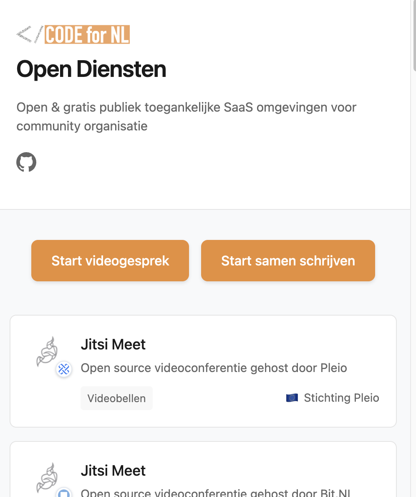

# OpenDienstenNL
Aanbod van SaaS open diensten voor het organiseren van community

Check ook https://european-alternatives.eu/

## Productvisie

Her en der zijn er overzichten van open source tools voor community organisatie. Probleem is dat de meeste mensen niet in staat zijn om die tools zelf ergens te hosten. Aan de andere kant zijn er best wel wat non-profit organisaties die open source software aanbieden als een dienst. Dit is de facto vrij toegankelijke publieke ruimte, waar iedereen gebruik van kan maken zonder technische barrières.

Op deze pagina willen we die ruimtes over het voetlicht brengen. Daarbij willen we aangeven of ze onder Europese wetgeving vallen, onder andere in het kader van de privacy. Ook willen we indicatoren geven voor de kwaliteit en de duurzaamheid (investeren ze mee in de onderliggende software) van de dienst.

Op die manier willen we een startpagina zijn voor community orgnisatoren die "good public tech" zoeken voor hun community.

## Bijdragen

Check [CONTRIBUTING.md](CONTRIBUTING.md) voor meer informatie over hoe je kunt bijdragen aan dit project.
